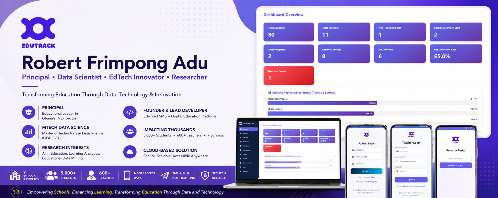
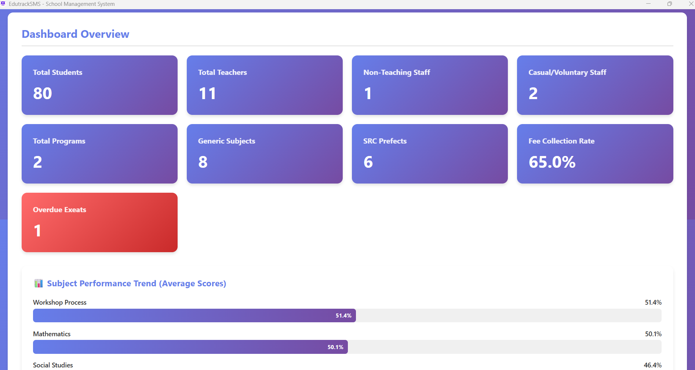
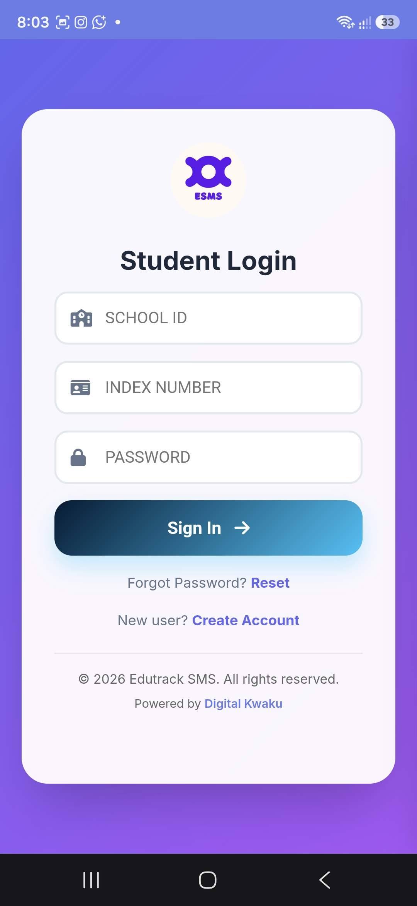

  

I am an educational leader, Data Scientist, and technology entrepreneur from Ghana with a passion for leveraging data and technology to transform education.

I hold a Master of Technology (MTech) in Data Science (GPA: 3.81) and currently serve as a Principal within Ghana's Technical and Vocational Education and Training (TVET) sector.

My work focuses on Educational Technology, Learning Analytics, Artificial Intelligence in Education, Digital Transformation, and Data-Driven Decision Making.

## About Me 🚀

* 🎓 MTech in Data Science
* 🏫 Principal in Ghana's TVET Sector
* 💡 Founder & Lead Developer of EduTrackSMS
* 📊 Passionate about Learning Analytics and Educational Data Mining
* 🎯 Aspiring PhD Researcher in AI and Data Science for Education
* 🌱 Currently learning: Advanced Machine Learning, Educational Data Mining, and AI-powered Learning Analytics
* 🔭 Working on: Expanding EduTrackSMS and developing predictive models for student performance analysis
* 🌍 Languages: English and Twi
* 📫 Reach me: [robertfrimpong.adu@gtvets.gov.gh](mailto:robertfrimpong.adu@gtvets.gov.gh)
* ⚡ Fun fact: I built and deployed a school management platform serving over 5,000 students and 600 teachers across multiple schools.

## My Skills 🧠

### Data Science & Analytics

### Web & Application Development

### Education Technology

## Featured Projects 💻

# EduTrackSMS Platform
### Administrative Dashboard

  

### Mobile Portals

  
  
  

### EduTrackSMS
A cloud-based online/offline desktop app educational management platform helping schools operate digitally and make data-driven decisions.

#### Key Features

* Student Information Management
* Attendance Tracking
* Assignment/Lesson Materials Management
* Academic Reports
* Student Exeat Management
* Teacher Attendance Management
* Fees Management
* SMS Notifications
* Push Notifications
* Parent Portal(PWA)
* Teacher Portal(PWA)
* Security Portal (PWA)

#### Impact

* Supporting 7 Schools
* Serving 5,000+ Students
* Serving 600+ Teachers

#### Technology Stack

* HTML
* CSS
* JavaScript
* Firebase
* MNotify SMS API

### Student Performance Prediction using Artificial Neural Networks

A Data Science project focused on predicting student academic performance using machine learning and neural network models.

#### Skills Demonstrated

* Data Cleaning
* Feature Engineering
* Predictive Analytics
* Artificial Neural Networks
* Educational Data Analysis

## Research Interests 🔬

* Artificial Intelligence in Education
* Learning Analytics
* Educational Data Mining
* Student Performance Prediction
* Educational Technology
* Digital Transformation in Schools
* Data-Driven Educational Management

## Current Goal 🎯

I am preparing for doctoral research in Data Science, Artificial Intelligence, and Learning Analytics, with a focus on developing intelligent educational systems that improve student outcomes and support evidence-based educational decision-making.

## Connect With Me 📬

* LinkedIn: [www.linkedin.com/in/robertfrimpongadu](http://www.linkedin.com/in/robertfrimpongadu)
* Website: [www.edutracksms.com](http://www.edutracksms.com)
* Email: [robertfrimpong.adu@gtvets.gov.gh](mailto:robertfrimpong.adu@gtvets.gov.gh)

Thanks for visiting my profile!
